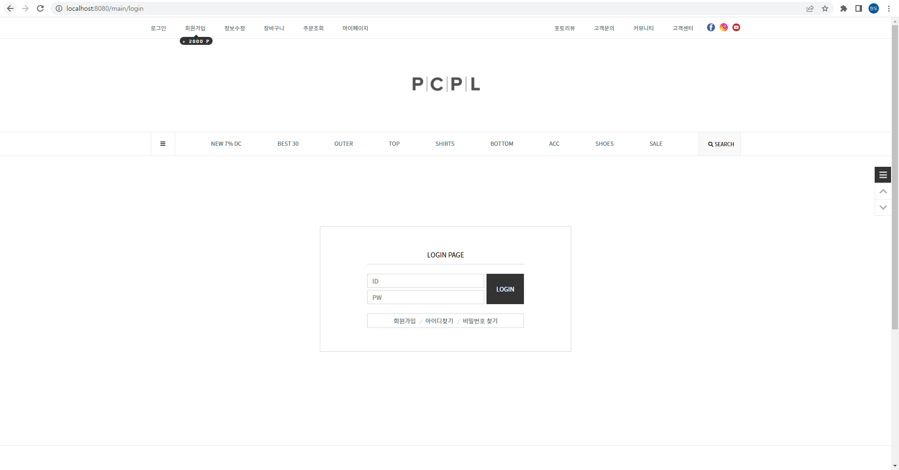

# Page27 clone Project
 교육용으로 제작한 page27 쇼핑몰 클론코딩 프로젝트 
 

## Part 

- 프론트 : 박준원, 채기웅
- 백엔드 : 박상순, 이현도

## 프로젝트 기능

- 회원가입 & 로그인
- 회원 마이페이지를 통한 정보 수정
- 관리자 페이지를 통한 회원, 상품, 주문 관리
- 주소 등록
- 장바구니
- 상품 주문 및 결제

## 기술 스택

#### 프론트 엔드
- html
- CSS
- JavaScript(jQuery, Ajax)
- Thymeleaf

#### 백엔드
- Spring Boot
- Spring Data JPA
- Spring Security
- QueryDsl
- H2
- gradle

## 개발 환경
- Intellij
- github

## 데이터베이스 ERD

  

## 서비스 및 기능

### 메인 화면
- main carousel, js 내에 setInterval 을 사용하여 일정 시간마다 슬라이드 되도록 구현
- 상품 사진 클릭 시 해당 상품의 상세 페이지로 이동 
 

##### 내비게이션
- 관리자 계정 로그인 시 관리자 페이지로 이동하는 버튼
- 토글, animate 로 스크롤 바 최상단, 최하단 
 

### 회원가입 / 로그인
회원가입
- 조건 적용을 위해 정규 표현식 사용
- Ajax 로 ID 중복확인 
 

##### 로그인
- Spring Security 적용 
  

### 관리자 기능
- ROLE ADMIN 이 아니면 
 

##### 관리자 메인화면
- 누적 방문자 수 및 상품, 주문, 회원 현황 요약 출력 

##### 상품 등록
- 상품 정보 저장(Querydsl)
- 이미지 파일 업로드(commons-io 라이브러리) 
 

##### 상품 목록
- 동적 검색 기능(Querydsl) 
 

- 상품 상태 변경(판매, 품절) 및 삭제 
  

##### 관리자 주문 관리
- 동적 검색 기능(Querydsl) 
  

### 회원 기능
##### 마이페이지
- 잔여 마일리지, 주문상태 확인
- 주문목록, 정보수정, 마일리지 적립내역, 배송지 목록 페이지 이동 가능 
 

##### 정보 수정
- 회원 정보 수정 및 회원 탈퇴(Ajax) 
 

##### 주문 조회
- 주문 상태, 기간에 따라 동적 검색(Querydsl), 데이터 조회(Paging)
- 주문 취소, 교환, 반품 등 주문한 상품의 상태 변경(Ajax) 
 

### 상품 기능
상품 카테고리
- 상품 조회(Paging), 이미지 클릭 시 상세 페이지로 
 

##### 상품 상세
- 옵션 선택(COLOR, QUANTITY)
- 장바구니 버튼. 상품 장바구니 테이블에 저장 후 장바구니 페이지로
- 바로 구매 버튼. 결제 페이지로 
 

### 장바구니 기능
##### 장바구니 화면
- 상품 수량 변경 및 삭제 기능(Ajax)
- 선택상품주문, 선택된 상품 결제 페이지로
- 전체상품주문, 장바구니 모든 상품 결제 페이지로
- 각 상품 주문하기 버튼, 해당 상품만 결제 페이지로 
  

### 주문 기능
##### 주문 화면 
 

##### 주소 검색
- daum 우편번호 검색 api 적용 
 

##### 주문 완료
- 적립 예정 마일리지, 결제 금액 및 배송정보 확인 
 
